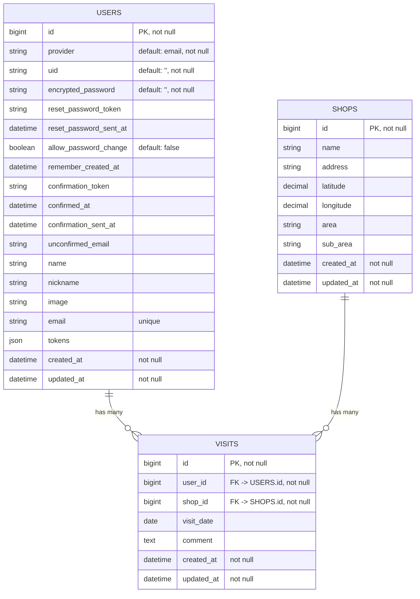

# セコマレコード / セイコーマート訪問記録管理サービス
## アプリ概要
セコマレコードは、「全てのセイコーマートの店舗に行きたい」という想いから作られた、無料のセイコーマート訪問記録管理ウェブアプリです。セコマの店舗検索システムとして使用することもできます。セイコーマート非公式。

**アプリURL:** https://secoma-record.com/

**開発者X:** https://x.com/miyoshi3rd

**分析ダッシュボード:** https://lookerstudio.google.com/reporting/0e398a30-366a-4ac4-ae41-f71537df997e

## 使用技術一覧
**バックエンド:** Ruby 3.2.2 / Rails 7.2.2.1
- コード解析 / フォーマッター: Rubocop
- テストフレームワーク: RSpec
- 主要ライブラリ: devise-token-auth / active_model_serializers / brakeman

**フロントエンド:** TypeScript ^5 / Next.js 15.1.4
- コード解析: ESLint
- フォーマッター: Prettier
- テストフレームワーク: Jest / React Testing Library
- CSSフレームワーク: Tailwind CSS
- 主要パッケージ: shadcn / axios / swr / react-hook-form / lucide-react

**DB:** PostgreSQL 15

**インフラ:** Vercel / fly.io / Cloudflare

**CI / CD:** GitHub Actions

**環境構築:** Docker / Docker Compose

**外部API:**
- Google Maps JavaScript API（地図上で店舗の位置を表示するために使用）
- Google Places API（店舗情報の取得に使用）

## 機能

### ユーザー向け
**機能**
- メールアドレスを利用したユーザー登録 / ログイン機能
- パスワード再設定機能
- 店舗の検索機能
- 訪問記録の取得 / 作成 / 更新 / 削除

**画面**
- レスポンシブデザイン
- ローディング画面
- 404 / 500エラーのカスタム画面
- スナックバー表示

### 非ユーザー向け
**システム / インフラ**
- Dockerによる開発環境のコンテナ化
- Cloudflareによる独自ドメイン + SSL化
- GitHub ActionsによるCI / CDパイプラインの構築
    - バックエンド
        - CI: Rubocop / RSpec
        - CD: fly.io
    - フロントエンド
        - CI: ESLint / Prettier / Jest / Codecov
        - CD: Vercel

**テスト / セキュリティ**
- クロスブラウザテスト
    - PC
        - Windows 11: Google Chrome / Firefox / Microsoft Edge
        - Mac: Google Chrome / Firefox / Safari / Microsoft Edge
    - スマートフォン
        - Android: Google Chrome
        - iOS: Safari / Google Chrome
- Codecovによるコードカバレッジの分析と可視化
- 脆弱性対応（Dependabot Alerts / Code Scanning Alerts / GitGuardian）

## ER図

## APIエンドポイント一覧
| HTTPメソッド | エンドポイント | 説明 |
|-------------|--------------|------|
| `POST` | `/api/v1/auth/sign_up` | ユーザー登録 |
| `POST` | `/api/v1/auth/sign_in` | ユーザーログイン |
| `DELETE` | `/api/v1/auth/sign_out` | ユーザーのサインアウト |
| `POST` | `/api/v1/visits` | 訪問記録の作成 |
| `GET` | `/api/v1/visits?shop_id=X` | 指定店舗の訪問記録取得 |
| `PUT` | `/api/v1/visits/:id` | 訪問記録の更新 |
| `DELETE` | `/api/v1/visits/:id` | 訪問記録の削除 |
| `GET` | `/api/v1/areas` | エリア一覧取得 |
| `GET` | `/api/v1/areas/:id` | 詳細エリア一覧取得 |
| `GET` | `/api/v1/shops?area_id=X` | 指定エリアの店舗一覧取得 |
| `GET` | `/api/v1/shops?sub_area=Y&area=Z` | 指定エリア・サブエリアの店舗一覧取得 |
| `GET` | `/api/v1/shops/by_sub_area?sub_area=Y&page=A&per_page=B` | サブエリアごとの店舗一覧取得（ページング対応） |
| `GET` | `/api/v1/shops/:id` | 店舗詳細情報取得 |
| `GET` | `/api/v1/shops/search_shops?query=キーワード` | 店舗検索 |
| `GET` | `/api/v1/areas/` | トップページでのエリア一覧取得 |

## 選定技術の採用理由
### バックエンド : Ruby / Ruby on Rails
**検討技術：** PHP / Laravel 
**採用理由**
- 先輩や友人にRailsエンジニアがいて質問できる環境だったため
- ProgateやRailsチュートリアルといった定番の学習サービスがあり、初心者でも学びやすい環境が整っていたため
- 転職先候補の企業での採用数が多かったため
- Rubyの開発者Matzさんが、自分の母校（筑波大学）のOBで縁を感じたため

### フロントエンド : React / Next.js
**検討技術：** Vue.js / Nuxt.js 
**採用理由**
- MicroCMSとNext.jsでブログを運用した経験があり、Next.jsには慣れていたため、開発効率を上げやすかった
- Vercelとの親和性が高く、簡単にデプロイ・運用ができるため

### 認証 : devise(gem)
**検討技術：** Firebase Authentication 
**採用理由**
- Railsのエコシステム内で完結しやすく、追加のランニングコストが不要なため
