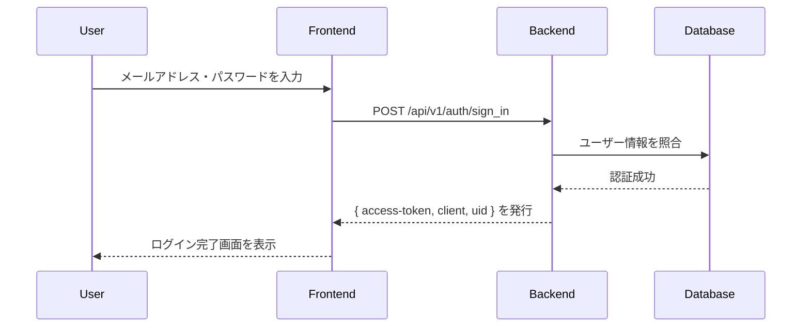
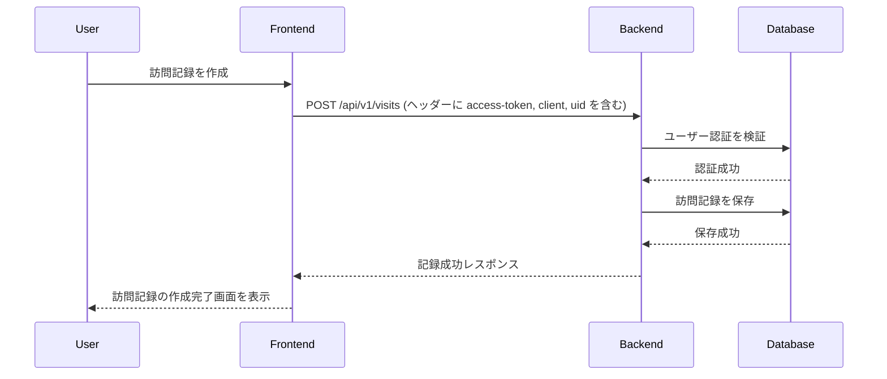
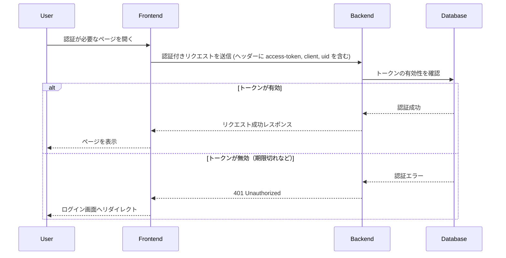
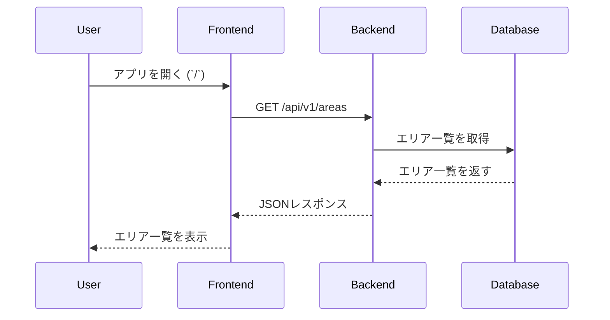
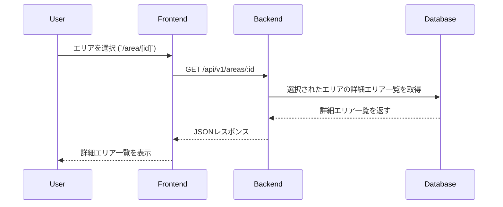
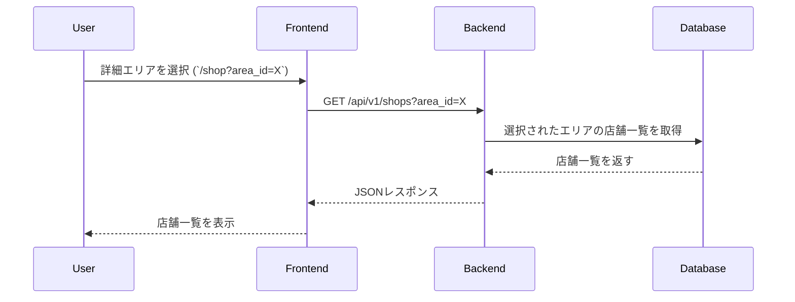
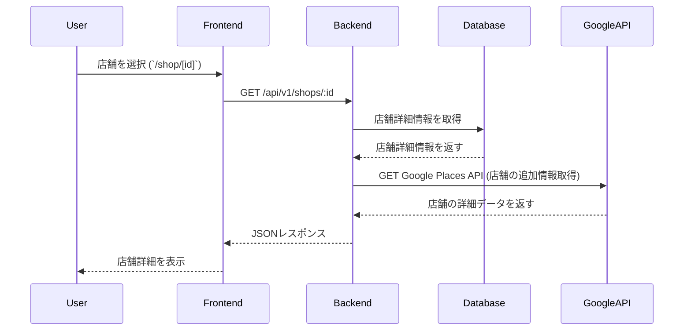

# セコマレコード / セイコーマート訪問記録管理サービス
## アプリ概要
セコマレコードは、「すべてのセイコーマートの店舗に行きたい」という想いから作られた、無料のセイコーマート訪問記録管理サービスです。会員登録せずに、セコマの店舗検索システムとして使用することもできます。セイコーマート非公式。

### ▼ アプリURL<br>
https://secoma-record.com/<br>
レスポンシブ対応済のため、PCでもスマートフォンでも快適にご利用いただけます。


### ▼ 開発者X<br>
https://x.com/wage790<br>
何かあれば、こちらまでお気軽にご連絡ください。


## 使用技術一覧
**バックエンド:** Ruby / Rails
- コード解析 / フォーマッター: Rubocop
- テストフレームワーク: RSpec

**フロントエンド:** TypeScript / Next.js
- コード解析: ESLint
- フォーマッター: Prettier
- CSSフレームワーク: Tailwind CSS
- 主要パッケージ: shadcn / axios / SWR / react-hook-form

**DB:** PostgreSQL

**インフラ:** Vercel / fly.io / Cloudflare

**CI / CD:** GitHub Actions

**環境構築:** Docker / Docker Compose

**API:**
- Google Maps JavaScript API（地図上で店舗の位置を表示するために使用）
- Google Places API（店舗情報の取得に使用）
- Google Photos API（店舗外観画像の取得に使用）

## 機能

### ユーザー向け
**機能**
- メールアドレスを利用したユーザー登録 / ログイン機能
- パスワード再設定機能
- 訪問記録の作成 / 更新 / 削除
- セイコーマートの検索機能

**画面**
- ローディング画面
- レスポンシブデザイン
- スナックバー

### 非ユーザー向け
**システム / インフラ**
- Next.jsのImage / Linkコンポーネントなどの活用によるサービス全体の高速化
- Dockerによる開発環境のコンテナ化
- Cloudflareによる独自ドメイン + SSL化
- GitHub ActionsによるCI / CDパイプラインの構築
    - バックエンド
        - CI: Rubocop / RSpec
        - CD: fly.io
    - フロントエンド
        - CI: ESLint / Prettier
        - CD: Vercel

**テスト / セキュリティ**
- クロスブラウザテスト
    - PC
        - Windows10 / 11: Google Chrome / Firefox / Microsoft Edge
        - Mac: Google Chrome / Firefox / Safari / Microsoft Edge
    - スマートフォン
        - Android: Google Chrome
        - iOS: Safari / Google Chrome
- Codecovによるコードカバレッジの分析と可視化
- 脆弱性対応（Dependabot Alerts / Code Scanning Alerts / GitGuardian）

## ER図


## 画面遷移図
### 店舗情報
- エリア一覧: /
- 詳細エリア一覧: /area/[id]
- 店舗一覧: /shop
- 店舗詳細: /shop/[id]
- 検索結果: /search

### 認証関連
- サインアップ: /sign_up
- サインイン: /sign_in
- サインアウト: /sign_out
- パスワードリセット: /password_reset

### 静的ページ
- 利用規約: /terms
- プライバシーポリシー: /privacy-policy

## 選定技術の採用理由
### バックエンド : Ruby / Ruby on Rails
**検討技術：** PHP / Laravel<br>
**採用理由**
- 先輩や友人にRailsエンジニアがいて質問できる環境だったため
- ProgateやRailsチュートリアルといった定番の学習サービスがあり、初心者でも学びやすい環境が整っていたため
- 転職先候補の企業での採用数が多かったため
- Rubyの開発者Matzさんが、自分の母校（筑波大学）のOBで縁を感じたため

### フロントエンド : React / Next.js
**検討技術：** Vue.js / Nuxt.js<br>
**採用理由**
- MicroCMSとNext.jsでブログを運用した経験があり、Next.jsには慣れていたため、開発効率を上げやすかった
- Vercelとの親和性が高く、簡単にデプロイ・運用ができるため

### 認証 : devise(gem)
**検討技術：** Firebase Authentication<br>
**採用理由**
- Railsのエコシステム内で完結しやすく、追加のランニングコストが不要なため

## シーケンス図
### ユーザー登録


### ログイン


### 訪問記録の作成


### トークンの有効期限の確認


### エリア一覧: /


**レスポンス例**
```json
{
  "areas": [
    { "id": 1, "name": "札幌" },
    { "id": 2, "name": "釧路・阿寒・根室・川湯・屈斜路" },
    { "id": 3, "name": "帯広・十勝" }
  ]
}

```

### 詳細エリア一覧: /area/[id]


**レスポンス例**
```json
{
  "area": {
    "id": 1,
    "name": "札幌",
    "sub_areas": [
      { "id": 101, "name": "中央区" },
      { "id": 102, "name": "北区" },
      { "id": 103, "name": "東区" }
    ]
  }
}

```
### 店舗一覧: /shop


**レスポンス例**
```json
{
  "shops": [
    {
      "id": 1001,
      "name": "セイコーマートあさの店",
      "address": "北海道札幌市中央区南４条西４-１１"
    },
    {
      "id": 1002,
      "name": "セイコーマート帯広白樺通店",
      "address": "北海道帯広市西１９条南３丁目５５番２０号"
    }
  ]
}
```

### 店舗詳細: /shop/[id]


**レスポンス例**
```json
{
  "shop": {
    "id": 1001,
    "name": "セイコーマート中士幌店",
    "address": "北海道河東郡士幌町字中士幌西２線７８",
    "latitude": 43.1443337,
    "longitude": 143.2394352,
    "created_at": "2025-01-15T21:51:38.008+09:00",
    "updated_at": "2025-01-16T14:16:29.391+09:00"
  }
}
```

### 検索結果: /search
