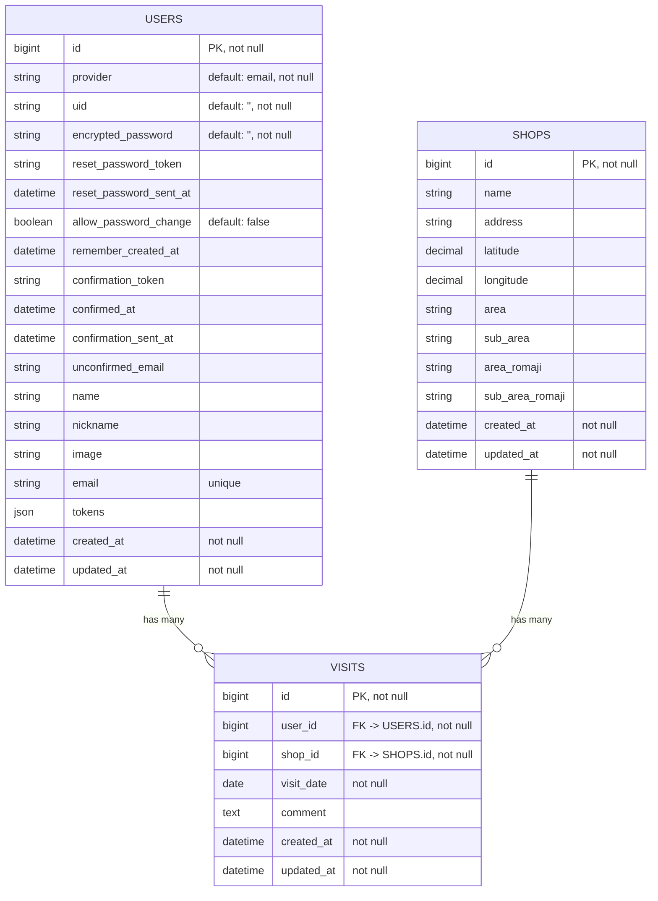

# セコマレコード / セイコーマート訪問記録管理サービス

## アプリ概要
セコマレコードは、「全てのセイコーマートの店舗に行きたい」という想いから作られた、無料のセイコーマート訪問記録管理ウェブアプリです。セコマの店舗検索システムとして使用することもできます。セイコーマート非公式。

**アプリURL:** https://secoma-record.com/

**開発者X:** https://x.com/miyoshi3rd

**分析ダッシュボード:** https://lookerstudio.google.com/reporting/0e398a30-366a-4ac4-ae41-f71537df997e

## 使用技術一覧
**バックエンド:** Ruby 3.2.2 / Rails 7.2.2.1
- コード解析 / フォーマッター: Rubocop
- テストフレームワーク: RSpec
- 主要ライブラリ: devise-token-auth

**フロントエンド:** TypeScript 5.7.3 / Next.js 15.1.4
- コード解析: ESLint
- フォーマッター: Prettier
- テストフレームワーク: Jest / React Testing Library
- CSSフレームワーク: Tailwind CSS
- 主要パッケージ: shadcn / axios / swr

**DB:** PostgreSQL 15

**インフラ:** Vercel / fly.io / Cloudflare

**CI / CD:** GitHub Actions

**環境構築:** Docker / Docker Compose

**外部API:**
- Google Maps JavaScript API（地図上で店舗の位置を表示するために使用）
- Google Places API（店舗情報の取得に使用）

## 機能

### ユーザー向け
**機能**
- メールアドレスを利用したユーザー登録 / ログイン機能
- 店舗の検索機能
- 訪問記録の取得 / 作成 / 更新 / 削除

**画面**
- レスポンシブデザイン
- ローディング画面
- 404 / 500エラーのカスタム画面
- スナックバー表示
- パンくずリスト

### 非ユーザー向け
**システム / インフラ**
- Dockerによる開発環境のコンテナ化
- Cloudflareによる独自ドメイン + SSL化
- Sentryによるエラー監視
- GitHub ActionsによるCI / CDパイプラインの構築
    - バックエンド
        - CI: Rubocop / RSpec
        - CD: fly.io
    - フロントエンド
        - CI: ESLint / Prettier
        - CD: Vercel

**テスト / セキュリティ**
- クロスブラウザテスト
    - PC
        - Windows 11: Google Chrome / Firefox / Microsoft Edge
        - Mac: Google Chrome / Firefox / Safari / Microsoft Edge
    - スマートフォン
        - Android: Google Chrome
        - iOS: Safari / Google Chrome
- 脆弱性対応（Dependabot Alerts / Code Scanning Alerts / GitGuardian）

## ER図

