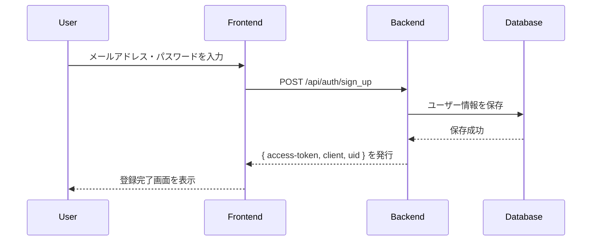
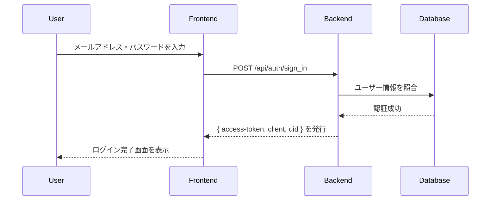
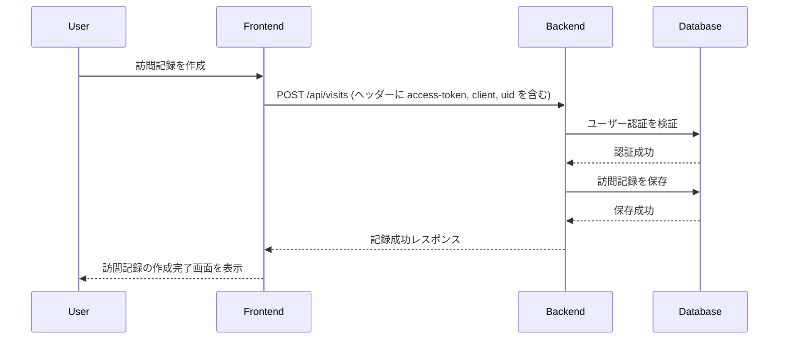
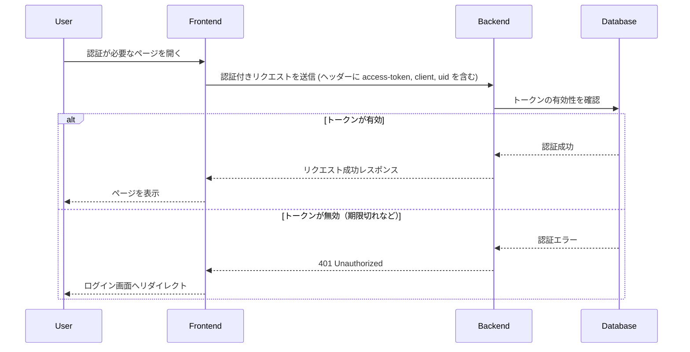

## ユーザー登録

```mermaid
sequenceDiagram
    participant User
    participant Frontend
    participant Backend
    participant Database

    User->>Frontend: メールアドレス・パスワードを入力
    Frontend->>Backend: POST /api/auth/sign_up
    Backend->>Database: ユーザー情報を保存
    Database-->>Backend: 保存成功
    Backend-->>Frontend: { access-token, client, uid } を発行
    Frontend-->>User: 登録完了画面を表示
```

## ログイン

```mermaid
sequenceDiagram
    participant User
    participant Frontend
    participant Backend
    participant Database

    User->>Frontend: メールアドレス・パスワードを入力
    Frontend->>Backend: POST /api/auth/sign_in
    Backend->>Database: ユーザー情報を照合
    Database-->>Backend: 認証成功
    Backend-->>Frontend: { access-token, client, uid } を発行
    Frontend-->>User: ログイン完了画面を表示
```

## 訪問記録の作成

```mermaid
sequenceDiagram
    participant User
    participant Frontend
    participant Backend
    participant Database

    User->>Frontend: 訪問記録を作成
    Frontend->>Backend: POST /api/visits (ヘッダーに access-token, client, uid を含む)
    Backend->>Database: ユーザー認証を検証
    Database-->>Backend: 認証成功
    Backend->>Database: 訪問記録を保存
    Database-->>Backend: 保存成功
    Backend-->>Frontend: 記録成功レスポンス
    Frontend-->>User: 訪問記録の作成完了画面を表示
```

## トークンの有効期限の確認

```mermaid
sequenceDiagram
    participant User
    participant Frontend
    participant Backend
    participant Database

    User->>Frontend: 認証が必要なページを開く
    Frontend->>Backend: 認証付きリクエストを送信 (ヘッダーに access-token, client, uid を含む)
    Backend->>Database: トークンの有効性を確認
    alt トークンが有効
        Database-->>Backend: 認証成功
        Backend-->>Frontend: リクエスト成功レスポンス
        Frontend-->>User: ページを表示
    else トークンが無効（期限切れなど）
        Database-->>Backend: 認証エラー
        Backend-->>Frontend: 401 Unauthorized
        Frontend-->>User: ログイン画面へリダイレクト
    end
```
