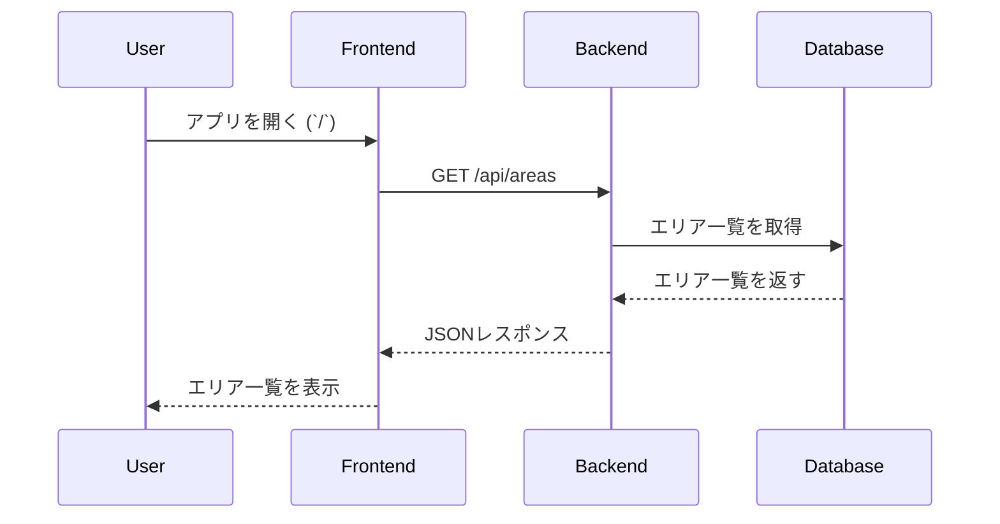
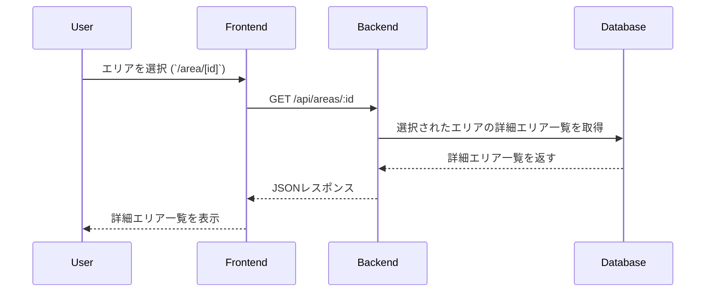
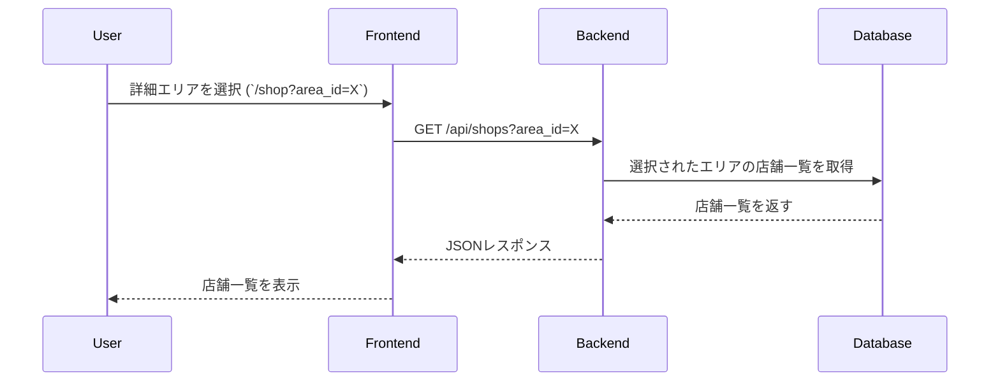
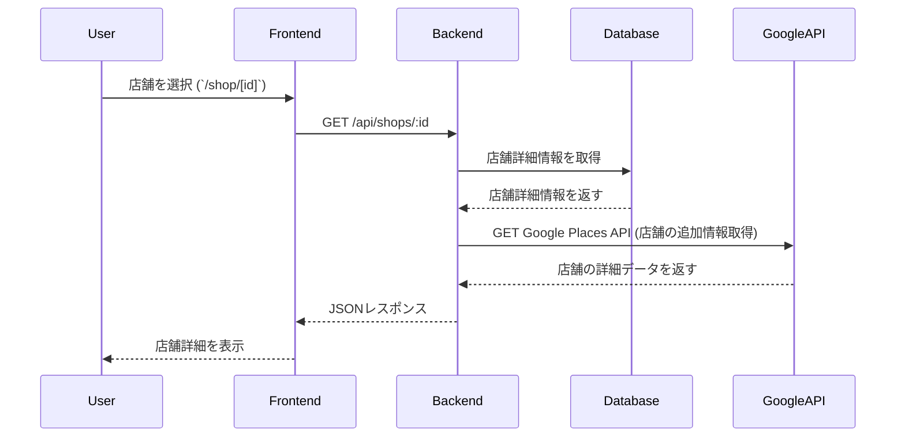

## エリア一覧: /


**レスポンス例**
```json
{
  "areas": [
    { "id": 1, "name": "札幌" },
    { "id": 2, "name": "釧路・阿寒・根室・川湯・屈斜路" },
    { "id": 3, "name": "帯広・十勝" }
  ]
}

```

## 詳細エリア一覧: /area/[id]


**レスポンス例**
```json
{
  "area": {
    "id": 1,
    "name": "札幌",
    "sub_areas": [
      { "id": 101, "name": "中央区" },
      { "id": 102, "name": "北区" },
      { "id": 103, "name": "東区" }
    ]
  }
}

```
## 店舗一覧: /shop


**レスポンス例**
```json
{
  "shops": [
    {
      "id": 1001,
      "name": "セイコーマートあさの店",
      "address": "北海道札幌市中央区南４条西４-１１",
      "latitude": 43.055,
      "longitude": 141.345
    },
    {
      "id": 1002,
      "name": "セイコーマート帯広白樺通店",
      "address": "北海道帯広市西１９条南３丁目５５番２０号",
      "latitude": 42.923,
      "longitude": 143.197
    }
  ]
}
```

## 店舗詳細: /shop/[id]


**レスポンス例**
```json
{
  "shop": {
    "id": 1001,
    "name": "セイコーマートあさの店",
    "address": "北海道札幌市中央区南４条西４-１１",
    "latitude": 43.055,
    "longitude": 141.345,
    "photo_url": "https://maps.googleapis.com/.../photo_reference"
  }
}
```

## 検索結果: /search
